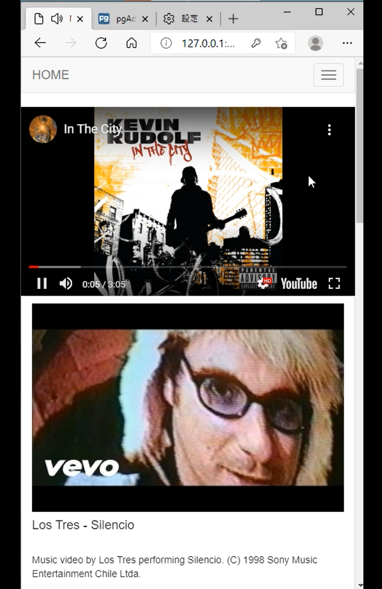

# music_RC_DEMO

深度學習音樂推薦系統
2020/4~2020/7
研究所論文系統延伸 - 音樂推薦系統
- 主架構參考自 https://hackmd.io/@shaoeChen/HJiZtEngG/https%3A%2F%2Fhackmd.io%2Fs%2FrkgXYoBeG
- 基於深度學習技術RNN模型設計推薦系統
- Python flask結合jinja設計使用者介面
- 利用Ajax及jquery優化使用者體驗
- 利用模型得到的推薦清單結合Youtube Data API來提供音樂推薦服務
- 利用ORM sqlalchemy存取資料庫
- Demo: https://youtu.be/r3OZ-CzoqHI

## 主介面
